<p align="center">
  
</p>

<p align="center">
  
  
  
  
  
</p>

<p align="center">
  <sub>Боевой слой сервера «РАСКОЛ | ДВЕ КОРОНЫ»: пять классов, две короны, одна война.</sub>
</p>

---

## I. ДВЕ КОРОНЫ

Земли Раскола разорваны надвое. Каждый класс служит одной из корон — и несёт её цвет в титуле и ауре.

| Корона | Цвет и аура | Природа |
|---|---|---|
| **Рассвет** | золото · `END_ROD` | Свет, порядок, клятва |
| **Вальрадис** | багрянец · `SOUL_FIRE_FLAME` | Дракон, пепел, долг |

Корона даёт классу титул (Рассветный клинок, Коготь Вальрадиса, …) и партикл-ауру, видимую союзникам и врагам.

---

## II. КЛАССЫ И ТРАДИЦИИ

| Класс | Традиция | Ресурс | Атрибут | Роль |
|---|---|---|:---:|---|
| Воин | Нордика | Ярость, −5/с вне боя | STR | Передовая линия, execute-финишеры |
| Охотник | Путь ведьмака | Концентрация, +5/с вне боя | AGI | Дистанционное давление, метки |
| Жрец | Католика | Свет, +2/с всегда | INT | Лечение, щиты, кары |
| Маг | Эллада | Мана, тиры по порогам | INT | Бурст, контроль, зоны |
| Разбойник | Ночные гильдии | Энергия, +10/с | AGI | Скрытность, яды, атака со спины |

Ресурс 0–100. Боевое окно 5 с разделяет режимы регена по классам.

---

## III. ЗДОРОВЬЕ И БОЙ

```
HP = base-hp + STR×per-str + level×per-level + (STR-main ? level×main-str-bonus : 0) + gear-hp
```

- Ванильный `max_health` — носитель-пропорция (предел движка 1024).
- Боевой пул, урон, хилы, капы и HUD работают в формульных единицах через `scale = carrier / formula`.
- Потолок 1024 снят без датапаков: воин L60·STR84 = 2560 HP.
- Четыре типа урона, резисты класса и шмота, burst-окно 3 с ≤ 18%, анти-ваншот ≤ 35%, LOS для площадей, летальность среды.

| Класс | L40 | L60 |
|---|---:|---:|
| Воин | ≈ 1780 | ≈ 2560 |
| Маг / Жрец | ≈ 700 | ≈ 840 |

---

## IV. МОДУЛИ

| Модуль | Назначение |
|---|---|
| Способности 1–5 | Свитки в хотбар, КД-полоса прочностью, `base + Power×coeff` |
| Специализации | Пассивная идентичность с 40 ур., платный респец с двойным подтверждением |
| Таланты | 10 деревьев × 9 узлов, только в Книге класса |
| Уровень персонажа | Среднее топ-5 скиллов AuraSkills, кап 60 |
| Инсталляции | Мины, варды, руна-зона; TTL, лимиты 2/200, килл-кредит |
| Короны | Рассвет / Вальрадис: титулы и партикл-ауры |
| TTK-харнесс | `/rc debug simulate`, матрица 5×5, якорь 20 с |
| RaskolGear-хук | Статы шмота из PDC без правок чужого плагина |
| Надёжность | Атомарные сейвы с `.bak`, автосейв, ConfigValidator, NaN-гарды |

---

## V. КОМАНДЫ

| Команда | Право | Назначение |
|---|---|---|
| `/rc` | — | Сводка игрока |
| `/rc menu` | — | Книга класса: способности, спеки, класс, таланты, шмот |
| `/rc gear [player]` | debug | Экипировка, статы шмота, сеты N/4 |
| `/rc debug [player]` | debug | Атрибуты, резисты, симулятор, таланты |
| `/rc debug simulate …` | debug | Дуэль и матрица TTK |
| `/rc health` | debug | MSPT/TPS, purge, аптайм |
| `/rc selftest` | debug | 36 headless-чеков формул |
| `/rc reload` | admin | Перезагрузка конфига, reconcile |

Способности и инсталляции применяются только свитками в хотбаре.

---

## VI. ПЛЕЙСХОЛДЕРЫ

```
%raskolclasses_class%         %raskolclasses_level%         %raskolclasses_hp%
%raskolclasses_hp_max%        %raskolclasses_resource%      %raskolclasses_phys_resist%
%raskolclasses_magic_resist%  %raskolclasses_dodge%         %raskolclasses_parry%
%raskolclasses_crit_melee%    %raskolclasses_crit_spell%    %raskolclasses_spec%
%raskolclasses_talent_points% %raskolclasses_talents%       %raskolcrown_*%
```

---

## VII. RASKOLGEAR

| Что | Применяет в бою | Считает и показывает |
|---|---|---|
| Урон оружия, крит, проки | RaskolGear | — |
| Резисты шмота, сет-бонусы 4/4 | RaskolGear | RaskolClasses: `/rc gear`, Книга |
| `+HP` шмота | RaskolClasses, входит в `maxHp` | HUD, `/rc debug` |
| Классовые резисты | RaskolClasses | ResistService |
| Burst и single-hit cap | RaskolClasses | CombatService |
| Офенс WP/SP | Пропускается для оружия RaskolGear | — |

Циклический softdepend разрешается через `PluginEnableEvent`.

---

## VIII. УСТАНОВКА

```
mvn -B clean package
cp target/raskol-classes-1.9.3.2.jar plugins/
restart
rc selftest   →  36/36 PASS
```

<details>
<summary>Softdepend</summary>

LuckPerms, AuraSkills, PlaceholderAPI, RaskolCore, Towny, AuthMe, Vault, RaskolGear, RaskolEnchant. Каждый опционален, деградация graceful.

</details>

<details>
<summary>Регресс-матрица</summary>

Диагностики 1–5, бой 6–16, контент 17–30, план B и ресурсы 31–36. Полный прогон перед любым хотфиксом и релизом.

</details>

---

## IX. ДОКУМЕНТАЦИЯ

- [`RUNBOOK.md`](RUNBOOK.md) — аварии, гейты, тюнинг без пересборки
- [`CHANGELOG.md`](CHANGELOG.md) — история версий
- [`LICENSE`](LICENSE) — RASKOL Proprietary License v1.0

<p align="center">
  <sub>© 2026 hayferdahmer · RASKOL Proprietary License v1.0 · земли Раскола не терпят чужаков</sub>
</p>
