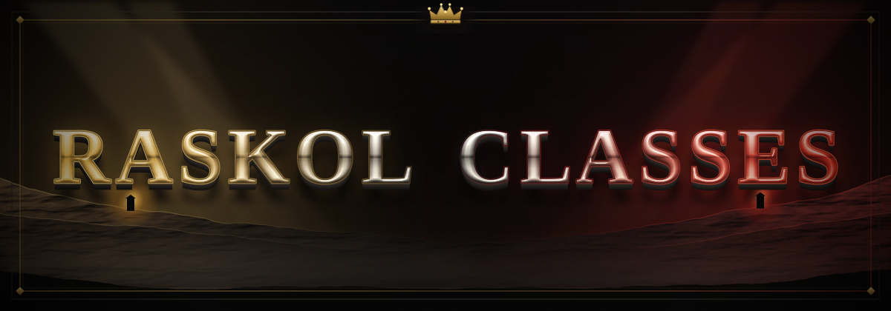

Боевой слой сервера «РАСКОЛ | ДВЕ КОРОНЫ»: шесть путей, две короны, одна война.

* * *

## I. ДВЕ КОРОНЫ

| Корона | Цвет и аура | Природа |
| --- | --- | --- |
| **Рассвет** | золото · `END_ROD` | Свет, порядок, клятва |
| **Вальрадис** | багрянец · `SOUL_FIRE_FLAME` | Дракон, пепел, долг |

Корона даёт классу титул и партикл-ауру, видимую союзникам и врагам.

* * *

## II. КЛАССЫ И ТРАДИЦИИ

| Класс | Традиция | Ресурс | Атрибут | Роль |
| --- | --- | --- | :-: | --- |
| Воин | Нордика | Ярость, −5/с вне боя | STR | Передовая линия, execute-финишеры |
| Охотник | Путь ведьмака | Концентрация, +5/с вне боя | AGI | Дистанция, метки, ловушки |
| Жрец | Католика | Свет, +2/с всегда | INT | Лечение, щиты, кары, очищение |
| Маг | Эллада | Мана, тиры по порогам | INT | Бурст, зоны, горение/охлаждение |
| Разбойник | Ночные гильдии | Энергия, +10/с | AGI | Скрытность, яды, спина |
| Чернокнижник | Фолиант Душ (скрытый) | Скверна, событийная | INT | Дрейн, диспел, анти-хил, DoT |

Ресурс 0–100 (Воин с `fury_rage_pool` — до 100 + бонус узла). Боевое окно 5 с
разделяет режимы регена.

* * *

## III. ШЕСТОЙ ПУТЬ: ЧЕРНОКНИЖНИК

**Доступ:** том «Фолиант Душ. Том I» падает с шансом **0.001%** с пиглинов ада
(урон должен нанести игрок). Прочесть может Маг/Жрец 40+ без основной спеки
и потраченных очков путей. Переход необратим: LP `class_warlock`,
прогрессия — **sorcery** (грант 10).

**Анти-фарм (S2):** после выпадения тома шанс обнуляется до скрытого цикла
«≥1 моб вне ада + ≥1 смерть + ≥1000 пиглинов без шанса» (`foliant-lock.yml`).

**Soulbound (S3):** том не падает на смерть, не выбрасывается Q, наземный
экземпляр поднимает только владелец.

**Скверна:** +9 урон / +5 получено / +15 убийство / +25 Чёрное Слово; вне боя
−4/с до 0 (Демонология: −2/с). 75+ → урон ×1.2, ccResist +10%, ccPower +20%;
100 → тик 1% maxHP/с. **Цена силы:** откат 6.66% (кап 30% maxHP, пол 1 HP);
в аду кит ×6. **Пентаграмма:** круг r6 / 25 с: врагам маг-урон + запрет
лечения, владельцу +3 Скверны/с; в аду урон ×6.

* * *

## IV. ДЕРЕВЬЯ ПУТЕЙ (СПЕК 2.0, 1.14.0 → 1.14.4)

С 15 уровня каждый класс открывает **3 специализации** с деревом прогрессии:
20 узлов, 6 рядов, гейты рядов по очкам внутри дерева `[0, 5, 10, 15, 20, 30]`
(ульт = ряд 6 @ 30 очков). Бюджет очков за карьеру = **46** (15→60, +1/уровень;
старт/бюджет/гейты читаются из `spec2.start-level` / `spec2.max-points` /
`spec2.row-gates`, **1.14.4**). Ёмкость каждого дерева **50–58 рангов** > 46 →
закрыть дерево математически нельзя: выбор ветки остаётся осознанным билдом,
как в WoW-референсе.

| Класс | Спеки (роль) |
| --- | --- |
| Воин | Оружие (F) · Неистовство (F) · Защита (T) |
| Охотник | Стрельба (F) · Выживание (F) · Повелитель зверей (F) |
| Жрец | Послушание (H) · Свет (H) · Тьма (F) |
| Маг | Тайная магия (F) · Огонь (F) · Лёд (F) |
| Разбойник | Ликвидация (F) · Головорез (F) · Скрытность (F) |
| Чернокнижник | Колдовство (F) · Разрушение (F) · Демонология (F) |

**Роли:** FIGHTER +2% урона · TANK +5% ccResist и +5% получаемого лечения ·
HEALER +5% исходящего лечения.

**Типы узлов:** passive_stat · passive_proc · unlock_ability (открывает
способность) · enhance_ability (усиливает кит/другую способность) · ultimate
(ряд 6, 1/1, сигнатурная способность спека). Ранги 1–5, стоимость ранга =
1 очко в любом из 3 деревьев класса; пререквизиты ранговые («требуется 2/2»).
Узлы `resist` принимают таргет-школу (`nature`, `fire`, …) и дают стихийный
резист (**1.14.4**).

**Управление:** `/rc menu` → «Специализации» (выбор основной спеки, один раз,
бесплатно, с 15 уровня) → «Деревья путей» (ЛКМ по узлу = +1 ранг;
**ПКМ по купленному узлу = респец одного ранга**: взвод 30 с → подтверждение,
цена `spec2.node-respec-base` + `spec2.node-respec-per-rank` × ранг, **1.14.4**;
кристалл = платный сброс ВСЕГО дерева с возвратом очков в общий пул).
Вкладка листает ряды ◀ ▶ и переключает спеки класса (main + 2 secondary).

* * *

## V. ЗДОРОВЬЕ, ШКОЛЫ, DoT, КОНТРОЛЬ, ПРОКИ

HP = base-hp + STR×per-str + level×per-level + (STR-main ? level×main-str-bonus : 0) + gear-hp,
далее × (1 + hp_pct/100) из узлов (1.14.4).

- План B: carrier ≤ 1024 (ванильный max_health), formula без потолка, scale = carrier/formula.
- HpPool: единые точки входа healFormula/currentFormulaHp/targetCarrier.
- Burst-окно 3 с ≤ 18%, анти-ваншот ≤ 35%, LOS для площадей, летальность среды.
- **Сохранение HP:** `hpBarService.saveAll()` в `onDisable` — HP не теряется при краше (1.14.1).

### Школы урона (1.12.x)

8 школ (PHYSICAL, FIRE, FROST, NATURE, SHADOW, HOLY, ARCANE, TRUE) сворачиваются
в 3 канала защиты. Митигация: канал-резист → пробитие (flat→pct, кап 40%) →
стихийный резист (кап 60%) → кап поглощения 90%. Иммунитеты/уязвимости мобов,
множители школ, vanilla-school маппинг причин урона.

### DoT-ядро (1.12.4–1.14.0)

Реестр `dots.*`: burning (FIRE), poison (NATURE), bleed (PHYSICAL),
chilled (FROST), **wither (SHADOW, 1.14.0)**. Стеки, атрибуция владельца,
кап суммарного DoT-DPS 6% formula-maxHP. Средовые триггеры: вода/пушистый
снег гасят огонь, огонь/лава плавят лёд. Очищение жреца снимает NATURE+SHADOW.
DoT-строка в HUD. Узлы деревьев тюнят DoT кастера (dot_dur/dot_stacks/dot_mult).

### Контроль и убывающая отдача (1.13.0)

9 типов CC, 6 категорий DR: окно 15 с, множители [1.0, 0.5, 0.25, 0.0] →
4-й CC в окне = иммунитет. ccResist/ccPower/ccReduction: класс + Скверна +
узлы деревьев + роль TANK. Запреты действий под CC, гейт каста, прерывание
каналов (CastChannels). Обёртка ванильных зелий (Slowness→SLOW, Blindness→BLIND,
Weakness→SILENCE) через DR; молоко и `/effect clear` снимают CC, но НЕ сбрасывают
DR. breaksOnDamage: ROOT/FEAR снимаются уроном ≥ 5% maxHP. Визуал — голограмма
TextDisplay над целью + звуки/партиклы (HUD-строки CC нет по дизайну).

### Проки и композиции (1.14.4)

`combat/ProcService` — единый фасад proc-узлов: мили (riposte, counterattack,
revenge, shield_slam, second_wind, bleed_on_crit, apply_poison, double_strike),
каст/утил (poison_extend, burning_extend, vendetta_refresh, stealth_bonus,
stealth_extend, reflect_magic, undodgeable, armor_pen, crit_bonus, savage,
headshot) и expose-дебафф цели. Amplifier следующего удара ставится на
**защищавшегося** (парирование/уклонение/блок). Лечение компонуется в одной
точке: `CustomHealEvent` = heal_out_pct × роль HEALER (исходящие) и
heal_received_pct + роль TANK (входящие); ванильные regain-события — тот же
набор без heal_out.

| Класс | L40 | L60 |
| --- | --: | --: |
| Воин | ≈ 1780 | ≈ 2560 |
| Маг / Жрец / Чернокнижник | ≈ 700 | ≈ 840 |

* * *

## VI. МОДУЛИ И АРХИТЕКТУРА (линия 1.14.4)

| Слой | Структура |
| --- | --- |
| Способности | `ability/*Abilities` (6 китов) + WarlockMath/WarlockFx (pure/визуал) |
| Пассивки | `ability/passive/ClassPassive` + 6 файлов по классам; PassiveListener = диспетчер |
| Инсталляции | `install/InstallationHandler` + 6 обработчиков; InstallationService = реестр |
| Бой | CombatService-фасад + VanillaDamageListener + DamageCaps + CombatMath (pure) |
| Школы | `combat/school/*`: School, SchoolProfile, SchoolConfig, SchoolMitigation, SchoolImmunity, PenTraitsService, ElementalResistService |
| DoT | `combat/dot/*`: DotDef, DotInstance, DotMath (pure), DotService |
| Контроль | `cc/*`: CCType, DRCategory, DRState, CCInstance, CCService, CCGuard, CastGuard, CastChannels, CCFeedback, VanillaCCWrapper, CcSub, CcSanity |
| **Проки (1.14.4)** | `combat/ProcService`: amplifier/expose/undodgeable/stealth-состояния, crit-mult bonus, dot-extend, vendetta refresh |
| **Лечение (1.14.4)** | `event/CustomHealEvent` + Spec2RoleListener (композиция heal_out/HEALER/heal_received/TANK) |
| **Спек 2.0** | `spec/*`: Spec (18), SpecRole, SpecRoles; `spec/model/*` (Spec2Node/Tree/Points/Effect); `spec/registry/trees/*Trees` (18 деревьев); `spec/storage/Spec2Storage` (**spec2-storage.yml**, миграция из spec2.yml, **1.14.4**); `spec/service/Spec2Service + Spec2EffectsApplier`; `spec/listen/Spec2RoleListener` |
| Атрибуты | AttributeService-фасад + HpPool (план B) + AttributeModifiers |
| **Книга (1.14.4)** | ClassBook-фасад + `gui/book/*Tab` (5 вкладок, включая «Деревья путей» с пагинацией рядов, переключателем спек и **ПКМ-респецом узла**) |
| HUD | HudService (ресурс + DoT-строка, O1 dirty-rendering) |
| Команды | RaskolCommand-роутер + `command/sub/*Sub` (debug, gear, foliant, health, cc) |
| Конфиг | config.yml + per-class `kits/<class>.yml` (приоритет, фолбэк, /rc reload) |
| Тесты | `/rc selftest` — **107 headless-чеков** (формулы, киты, школы, DoT, CC/DR, spec2, проки, респец) |

* * *

### Пет-система (1.14.6)
- Единый `PetService` вместо ad-hoc карт в китах
- **Волк** (Охотник/beastmaster): постоянный компаньон, scaling от СИЛЫ
- **Демон** (Чернокнижник/demonology): Vex 12 с, scaling от ИНТ
- **Тенескот** (Жрец/shadow): Vex 8 с, scaling от ИНТ
- Боевые гейты: `canHit` для союзников, ретаргет на цель владельца, дезспавн при смерти/выходе
- Баффы: `beast_ferocity` / `bestial_wrath` через `PetService.buff(...)` (dmgMult × speedMult × glow)
- Ульты: `demon_soul` (поглощение пета → Сила II + Сопротивление I), китовые бонусы ресурса (+10 Скверны/+10 Света)

* * *

## VII. КОМАНДЫ

| Команда | Право | Назначение |
| --- | --- | --- |
| `/rc` | — | Сводка игрока |
| `/rc menu` | — | Книга класса (5 вкладок: способности, спеки, класс, деревья путей, шмот) |
| `/rc gear [player]` | debug | Экипировка, статы шмота, сеты N/4 |
| `/rc debug [player]` | debug | Атрибуты, резисты, pen, стихии, CC/DR, очки путей |
| `/rc debug simulate …` | debug | Дуэль и матрица TTK 6×6 |
| `/rc health` | debug | MSPT/TPS, purge, аптайм, per-class конфиги |
| `/rc selftest` | debug | 107 headless-чеков |
| `/rc cc list` | admin.cc | Таблица 9 типов CC и категорий DR |
| `/rc cc status <player>` | admin.cc | Активные CC + DR-стеки + таймер окна |
| `/rc cc clear <player>` | admin.cc | Снять все CC + сбросить DR |
| `/rc cc test <player> <type>` | admin.cc | Наложить тестовый CC |
| `/rc cc reset <player> <cat>` | admin.cc | Сброс DR-стека категории |
| `/rc foliant give <ник>` | admin | Выдать Фолиант Душ (тест/резерв) |
| `/rc reload` | admin | Перезагрузка config.yml + kits/*.yml |

* * *

## VIII. ПЛЕЙСХОЛДЕРЫ

%raskolclasses_class% %raskolclasses_level% %raskolclasses_hp%
%raskolclasses_hp_max% %raskolclasses_resource% %raskolclasses_phys_resist%
%raskolclasses_magic_resist% %raskolclasses_dodge% %raskolclasses_parry%
%raskolclasses_crit_melee% %raskolclasses_crit_spell% %raskolclasses_spec%
%raskolclasses_talent_points% %raskolclasses_talents% %raskolcrown_*%

(`spec` / `talent_points` / `talents` с 1.14.0 читают spec2-слой: основная
спека, доступные очки, потрачено/заработано.)

* * *

## IX. RASKOLGEAR

| Что | Применяет в бою | Считает и показывает |
| --- | --- | --- |
| Урон оружия, крит, проки | RaskolGear | — |
| Резисты шмота, сет-бонусы 4/4 | RaskolGear | RaskolClasses: `/rc gear`, Книга |
| pen-трейты шмота (1.12.2) | RaskolClasses (PenTraitsService) | `/rc debug`, Книга |
| `+HP` шмота | RaskolClasses (HpPool) | HUD, `/rc debug` |
| Классовые/спек-резисты | RaskolClasses | ResistService + spec2-агрегат |
| Burst и single-hit cap | RaskolClasses | DamageCaps |

WARLOCK-сеты добавляются секциями `weapons.WARLOCK.*` / `armor.WARLOCK.*` в конфиг RaskolGear.

* * *
# Лицензия

© 2026 hayferdahmer — RASKOL Proprietary License v1.0.
Распространение, модификация и публичное использование вне сервера «РАСКОЛ | ДВЕ КОРОНЫ» запрещены без письменного разрешения автора.
